# pipetable

[](https://github.com/dominic-righthere/markdown-pipetable.nvim/actions/workflows/ci.yml)

Interactive, fit-to-width markdown tables for Neovim, rendered inline in your buffer.



pipetable takes the pipe tables in a markdown buffer and renders them to fit the
window, then lets you move around them cell by cell, scroll sideways, and edit
them like a small spreadsheet. The file on disk stays plain GitHub-flavored
markdown the whole time.

It's a standalone plugin. It doesn't depend on `render-markdown.nvim` (or any
other renderer) and isn't part of one.

## Features

- Tables are boxed and sized to the window. Columns that don't fit get truncated
  with `…` and a `›` marker instead of wrapping.
- The raw `| ... |` text stays the source of truth. The rendered view is painted
  on top of it with extmarks, so when you save you get normal markdown back.
- Vim-style modes, active only while the cursor is in a table:
  - `table-navigate` moves between cells and scrolls horizontally.
  - `in-cell` opens a small editor on the cell; its normal mode moves around
    inside the cell text.
  - `in-cell-edit` is that editor's insert mode, for actually changing the cell.
- Moving past the visible edge scrolls the table and keeps the focused cell in
  view. `‹` and `›` appear when there are more columns off-screen.
- It enters table mode on its own when the cursor lands on a table and leaves
  when the cursor moves away. `:Pipetable` toggles it by hand.
- Understands CJK / double-width characters and escaped pipes (`\|`).

## Requirements

- Neovim 0.10 or newer (0.11 recommended).
- Nothing else. Table detection uses a regex scanner that works out of the box;
  the treesitter `markdown` parser is only used as a fallback if it happens to be
  installed. Run `:checkhealth pipetable` to see what's active.

## Install

With lazy.nvim:

```lua
{
  'dominic-righthere/markdown-pipetable.nvim',
  ft = 'markdown',
  config = function()
    require('pipetable').setup({})
  end,
}
```

For local development, swap the repo string for `dir = '~/path/to/pipetable'`.

## Keymaps (while in a table)

| Mode | Key | Action |
|------|-----|--------|
| table-navigate | `h` `j` `k` `l` / arrows | move cell left / down / up / right |
| table-navigate | `_` `0` `^` | first column |
| table-navigate | `$` | last column |
| table-navigate | `gg` / `G` | first / last row |
| table-navigate | `<CR>` | enter the cell (in-cell, normal) |
| table-navigate | `i` / `a` | edit the cell (in-cell-edit, insert) |
| table-navigate | `u` / `<C-r>` | undo / redo |
| table-navigate | `<Esc>` / `q` | leave table mode |
| in-cell (editor) | `i` `a` `c` … | native insert (in-cell-edit) |
| in-cell-edit | `<CR>` | commit and return to table-navigate |
| in-cell-edit | `<Tab>` | commit and edit the next column |
| in-cell-edit | `<Esc>` | back to in-cell (normal) |
| editor | `q` (normal) | cancel the edit |

Pressing `k`/`j` off the top or bottom edge just leaves the table in that direction.

## Row and column operations

Direct keys in table-navigate:

| Key | Action |
|-----|--------|
| `o` / `O` | insert row below / above |
| `dd` | delete the current row |
| `yy` | yank the current row |
| `p` / `P` | paste below / above (right / left when the register holds a column) |

The rest live under a leader group. The prefix is `<leader>t` by default (change
it with `keys.leader`), and these are only mapped while you're in a table:

| Key | Action | Key | Action |
|-----|--------|-----|--------|
| `<leader>tir` / `tiR` | insert row below / above | `<leader>tic` / `tiC` | insert col right / left |
| `<leader>tdr` | delete row | `<leader>tdc` | delete column |
| `<leader>tmj` / `tmk` | move row down / up | `<leader>tmh` / `tml` | move col left / right |
| `<leader>tcr` | duplicate row | `<leader>tcc` | duplicate column |
| `<leader>tal` `tac` `tar` `tad` | align left/center/right/default | `<leader>ts` / `tS` | sort by column asc / desc |

Every operation rewrites the table in one edit, so `u` and `<C-r>` undo and redo
it in a single step.

## Selection (visual)

From table-navigate, `v` starts a cell-block selection, `V` selects whole rows,
and `<C-v>` selects whole columns. Extend with `h` `j` `k` `l` (and `gg` `G` `_`
`$`), and `v` / `V` / `<C-v>` switch the kind on the fly.

| Key | Action |
|-----|--------|
| `d` | delete: rows drop rows, columns drop columns, a cell block clears |
| `y` | yank the selection (also goes to the system clipboard as TSV) |
| `x` / `c` | clear the contents of the selected cells |
| `<Esc>` / `q` | cancel back to table-navigate |

## Configuration

`setup()` takes the following (defaults shown):

```lua
require('pipetable').setup({
  enabled = true,
  auto_enter = true,                 -- enter table-navigate when the cursor lands on a table
  filetypes = { 'markdown' },
  debounce = 16,                     -- ms to coalesce repaints
  format_on_edit = false,            -- repad the whole table source on commit
  column = { min_width = 3, max_width = 40, padding = 1 },
  border = { enabled = true, style = 'full' }, -- 'full' | 'rows' | 'none'
  overflow = { left = '‹', right = '›', ellipsis = '…', min_visible = 3 },
  cursor = {
    hide_real = true,        -- hide the real cursor in table-navigate
    row_highlight = true,    -- tint the whole active row
    column_highlight = false,-- tint the active column too (full crosshair)
  },
  keys = {
    enter = false,           -- optional normal-mode key to enter on a table
    -- every binding is a string, a list of strings, or false to disable
    nav = { left = 'h', down = 'j', up = 'k', right = 'l',
            first_col = '_', last_col = '$', first_row = 'gg', last_row = 'G',
            into_cell = '<CR>', edit = 'i', edit_append = 'a', exit = '<Esc>', quit = 'q' },
  },
  highlights = {
    -- each value is a group to LINK to (string) or an nvim_set_hl spec (table)
    cursor_cell = { reverse = true, bold = true }, -- the focused cell
    cursor_row  = 'CursorLine',                    -- active-row tint
    cursor_col  = 'CursorColumn',                  -- active-column tint
    border = 'Comment', header = 'Title', cell = 'Normal',
    overflow = 'NonText', edit = 'IncSearch',
  },
})
```

### Keys

`setup{ keys = ... }` is the usual "keys table" pattern. Note this is not
lazy.nvim's lazy-load `keys` field. Each action takes a string, a list of strings
(several keys for the same action), or `false` to turn it off. Bindings are
buffer-local and only active inside a table; whatever you had mapped before is
saved and restored when you leave.

```lua
keys = {
  nav = {
    right = { 'l', '<Right>', '<Tab>' }, -- multiple keys
    quit  = false,                       -- disable
  },
}
```

### Highlights

Each rendered piece is tagged with a fixed highlight group, and you set its look
through `highlights` in `setup()`. A value is either a group to link to (a string)
or an `nvim_set_hl` spec (a table). A value you set fully replaces the default,
and `false` leaves a group alone if you'd rather manage it yourself. Everything is
reapplied on `:colorscheme`.

| Logical key | Group | Default | Role |
|-------------|-------|---------|------|
| `border` | `PipetableBorder` | `Comment` | box/borders |
| `header` | `PipetableHeader` | `Title` | header row text |
| `cell` | `PipetableCell` | `Normal` | body cell text |
| `cursor_cell` | `PipetableCursorCell` | `{ reverse = true, bold = true }` | the focused cell |
| `cursor_row` | `PipetableCursorRow` | `CursorLine` | active-row tint (`cursor.row_highlight`) |
| `cursor_col` | `PipetableCursorColumn` | `CursorColumn` | active-column tint (`cursor.column_highlight`) |
| `selection` | `PipetableSelection` | `Visual` | visual selection |
| `overflow` | `PipetableOverflow` | `NonText` | `‹` / `›` / `…` indicators |
| `edit` | `PipetableEdit` | `IncSearch` | cell editor and mode badge |
| `hidden_cursor` | `PipetableHiddenCursor` | `{ blend = 100 }` | the hidden real cursor |

For example:

```lua
highlights = {
  cursor_cell = { bg = '#7aa2f7', fg = '#1a1b26', bold = true }, -- explicit colors
  cursor_row  = 'Visual',                                        -- link to another group
  border      = false,                                           -- leave PipetableBorder as-is
}
```

The reverse-video cell plus the active-row tint make it easy to see where you
are. Set `cursor.column_highlight = true` if you want a full spreadsheet crosshair.

### Statusline

`require('pipetable').status()` returns something like `TBL NAV 2:3`, or an empty
string when you're not in a table. There's also a small mode badge shown
right-aligned on the active row.

## Commands and `<Plug>` mappings

- `:Pipetable` toggles table mode on the current buffer.
- `:checkhealth pipetable` runs an environment check.
- The operations are commands too, and these also work outside table mode (they
  act on whichever table is under the cursor): `:TableInsertRow[!]` (`!` means
  above), `:TableDeleteRow`, `:TableInsertColumn[!]` (`!` means left),
  `:TableDeleteColumn`, `:TableMoveRow up|down`, `:TableMoveColumn left|right`,
  `:TableAlign left|center|right|default`, `:TableSort[!]` (`!` for descending),
  `:TableYank`, and `:TablePaste[!]` (`!` for above/left).
- There's a `<Plug>(pipetable-...)` mapping for every operation, for example
  `...-insert-col-right`, `...-delete-row`, `...-move-col-left`, `...-align-center`,
  `...-sort-asc`, `...-yank-row`, `...-paste-below`. Bind your own keys in any mode:
  ```lua
  vim.keymap.set('n', '<leader>ic', '<Plug>(pipetable-insert-col-right)')
  ```

## CSV / TSV conversion

pipetable stays focused on markdown tables, but it can convert to and from CSV/TSV
(it never edits a huge CSV in place — it converts a selection or the clipboard):

- `:[range]TableFromCSV[!] [delim]` — turn the selected CSV/TSV lines into a markdown
  table. `!` means TSV; pass an explicit delimiter (`tab`, `,`, `;`) or let it
  autodetect. Visual-select the rows and run it, or `<Plug>(pipetable-from-csv)`.
- `:TableToCSV[!]` — copy the table under the cursor to the clipboard as CSV
  (`!` = TSV). `<Plug>(pipetable-to-csv)`.
- `:TablePasteCSV[!]` — read CSV/TSV from the clipboard and insert it as a markdown
  table at the cursor. `<Plug>(pipetable-paste-csv)`.

Quoting follows RFC 4180 (`"`-quoted fields, `""` escapes, delimiters/newlines inside
quotes); pipes in cells are escaped (`\|`) on the way in.

## Worried about key conflicts?

Don't be. Every navigate/visual/operation key is buffer-local and only installed
while you're inside a table; your own mappings are saved on the way in and
restored on the way out. Nothing is mapped outside a table, so there's no
permanent or global conflict. The leader group only shadows your own `<leader>t...`
while you're actually sitting in a table.

If you want to change or drop the defaults:

- `keys.leader = '<localleader>t'` (or anything else) moves the whole operation group.
- `keys.ops = false` drops the leader group entirely. Any single binding set to
  `false` is skipped, and the direct keys live in `keys.nav.*` and `keys.visual.*`.
- Or turn the keymaps off and bind the `<Plug>` mappings (or use the `:Table*`
  commands) however you like.

## Using it with render-markdown.nvim

Out of the box both plugins render markdown tables, so they'll draw on top of each
other and you get doubled, garbled boxes. They also both touch the `conceallevel`
and `concealcursor` window options. The fix is to let render-markdown handle
headings, code, and lists, and let pipetable own tables. Turn off its table
rendering and stop it from fighting over `concealcursor`:

```lua
require('render-markdown').setup({
  -- ...your existing opts...
  pipe_table = { enabled = false },                        -- pipetable owns tables
  win_options = { concealcursor = { rendered = 'nvic' } }, -- keep pipetable's active row rendered
})
```

After that, headings keep render-markdown's styling and tables become interactive
through pipetable.

## Known limitations

- The modal view is tied to one window per buffer. If the same buffer is open in a
  split, table mode binds to the active window.
- A single column wider than the whole window scrolls into view but isn't
  sub-scrolled yet (no partial within-column scrolling).
